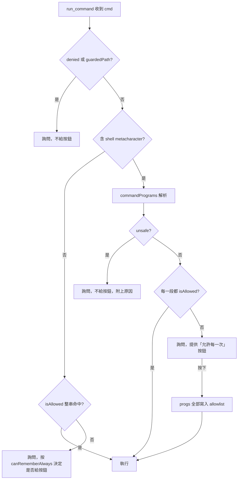

# 設計規格：權限對話框新增「允許每一次」按鈕

- 日期：2026-09-14
- 狀態：已核准，待實作
- 相關檔案：[src/tools.js](../../../src/tools.js)、[extension.js](../../../extension.js)、[src/i18n/](../../../src/i18n/)、[test/tools.test.js](../../../test/tools.test.js)

## 背景與問題

使用者選了「自動同意編輯檔案」（`mode: 'edit'`）後，仍然每次都被問「可以執行這個指令嗎？」。

原因是寫檔與執行指令走**兩道各自獨立的閘門**，`mode` 只管得到第一道：

| 閘門 | 位置 | `mode` 有無影響 |
|---|---|---|
| 工作區**內**寫檔確認 | `src/tools.js` `pathFor()` 中的 `if (write && mode === 'ask')` | 有。`edit` 靠這行跳過確認 |
| 工作區**外**讀寫 | `src/tools.js` `pathFor()` 的 catch 分支 | 無（`never` 除外） |
| `run_command` 許可清單 | `src/tools.js` `run_command()` 的守門判斷式 | 無（`never` 除外） |

唯一讓指令免問的是 `mode === 'never'`，因為 `askOrPass()` 只對 `never` 直接回 `'once'`：

```js
const askOrPass = async (q) => {
  if (mode === 'never') return 'once';
  return askPermission ? askPermission(q) : 'no';
};
```

這是刻意的語意，`package.json` 的 `chatgptBridge.mode` enum 說明也是這樣寫的。

真正的痛點在於**現有的「一直允許」按鈕對複合指令永遠不會出現**：

1. `run_command` 的守門判斷式中，`meta`（引號外含 `;` `&` `|` `` ` `` `$` `<` `>` 換行）是**無條件**觸發詢問的條件。
2. `rememberable` 的計算含 `!meta`，所以含 metacharacter 的指令拿不到 `always` 選項。
3. `isAllowed()` 拿**整串指令**比對前綴，複合指令不可能命中 `DEFAULT_ALLOWLIST`。

結果是像下面這種 AI 常送出的探索指令，每次都得手動按「只允許這次」，且永遠無法記住：

```bash
printf '%s\n' '--- rules ---' && (find rules -maxdepth 2 -type f -print 2>/dev/null || true) && ...
```

## 目標與非目標

**目標**：在權限對話框加一顆「允許每一次」按鈕，按下後把該指令用到的所有程式名一次寫入許可清單，之後同類複合指令自動放行。

**非目標**：

- 不新增第五個權限模式。真要全放行，既有的「略過權限確認」已經存在。
- 不改 `webview/panel.html`、`package.json` enum、`webview/src/ui/modeCycle.js`。
- 不改動許可清單的持久化位置與回收機制。

## 決策紀錄

| 決策 | 選擇 | 理由 |
|---|---|---|
| 「類似」的判定 | 記住指令中用到的所有程式名 | 唯一能真正做到「類似行為通通放行」；清單隨使用累積 |
| 無法安全解析時 | 不提供按鈕，只能允許這次 | 避免 `find -exec rm -rf` 這類挾帶結構被永久放行 |
| 範圍 | 只做按鈕，不加模式 | 模式選單維持四項，不增加認知負擔 |
| 記住的粒度 | 程式名（如 `git`） | 與現有 `always` 一致；兩段式（`git branch`）會讓命中率明顯下降 |

**已知取捨**：記住 `git` 等於放行所有 `git` 子指令，包含 `git push`、`git reset --hard`（`git branch -D` 仍被 denylist 擋）。因此對話框必須明列將記住哪些程式，讓使用者按下前看得到。

## 架構



## 元件

### `commandPrograms(cmd)`

新增於 `src/tools.js` 並匯出（供測試使用）。

**回傳**：`{ segments: string[], progs: string[], unsafe: string | null }`

**分段規則**：沿用 `splitArgs()` 的引號處理，但保留運算子。只在**指令位置**取程式名：

- 字串開頭
- `&&`、`||`、`;`、`|`、`&`、換行之後
- `do`、`then`、`else`、`elif`、`{`、`(` 之後

保留字本身不計為程式：`if`、`for`、`while`、`until`、`fi`、`done`、`esac`、`in`、`}`、`)`。前置的 `FOO=bar` 變數賦值跳過。

`segments` 是各段的完整指令文字（例如 `git status --short`），`progs` 是各段的程式名去重後的集合（例如 `['git']`）。

**`unsafe` 判定**（任一成立即回報原因鍵，且不提供按鈕）：

| 鍵 | 條件 | 理由 |
|---|---|---|
| `cmd.unsafe.substitution` | 引號外出現 `$(` 或 `` ` `` | 命令替換的內容可以是任何東西 |
| `cmd.unsafe.runsAnything` | 任一程式在 `RUNS_ANYTHING` | `bash`/`node`/`xargs`/`sudo`/`ssh`/`command` 能挾帶任意程式 |
| `cmd.unsafe.findExec` | `find` 帶 `-exec`、`-execdir`、`-ok`、`-okdir`、`-delete` | 現有黑名單的漏洞，必須補 |
| `cmd.unsafe.redirect` | `>` 或 `>>` 的目標不是 `/dev/null`、也不是工作區內相對路徑 | `2>/dev/null` 放行，`> ~/.zshrc` 擋下 |
| `cmd.unsafe.parse` | 詞法分析失敗（未閉合引號等） | 解析失敗一律往保守方向倒 |

`RUNS_ANYTHING` 補上 `command`（`command -v gh` 這種寫法能繞過程式名判定）。

### `run_command` 守門判斷式

```js
const parsed = meta ? commandPrograms(cmd) : null;
const metaOk = parsed && !parsed.unsafe && parsed.segments.length > 0
  && parsed.segments.every((s) => isAllowed(s, allowlist));

if (denied || guardedPath || (meta ? !metaOk : !isAllowed(cmd, allowlist))) {
  // 詢問
}
```

`denied` 維持整串正則比對，所以 `git push && git branch -D main` 仍會被 denylist 攔下，不受拆解影響。

**比對用 `segments` 而非 `progs`**：`isAllowed('git', ['git status'])` 是 false，若只比對程式名，既有的 `DEFAULT_ALLOWLIST` 會完全失效。用整段文字比對則 `git status && git diff` 的兩段都能命中既有清單。

**刻意的行為擴張**：由已許可指令組成的複合指令，從此不再詢問。這比「只加一顆按鈕」影響更大，是經過確認的設計決定。

### `always` 負載與對話框

`askOrPass()` 的 `always` 欄位型別擴充為 `string | string[]`：

```js
const rememberable = !denied && !guardedPath &&
  (meta ? (parsed && !parsed.unsafe) : canRememberAlways(prog));

always: rememberable ? (meta ? parsed.progs : prog) : null
```

ask 負載新增 `whyKey` 欄位攜帶 `unsafe` 原因鍵，由 `extension.js` 翻譯後附在指令下方，讓使用者知道為什麼沒有按鈕。

`extension.js` 的 `askPermissionFromPanel()` 在 `always` 為陣列時改用新的 i18n 鍵 `action.allowPrograms`。對話框由 `actions` 陣列驅動，**webview 不需修改**。

### 持久化

`allowAlwaysCommand()` 接受字串或陣列，去重後一次寫入 `chatgptBridge.allowlist`（Workspace 範圍），與現況一致。既有的 `forgetAllowed()` 不需改動即可逐條回收。

## 改動清單

| 檔案 | 改動 |
|---|---|
| [src/tools.js](../../../src/tools.js) | 新增並匯出 `commandPrograms()`；改守門判斷式；`always` 可為陣列；`RUNS_ANYTHING` 補 `command`；ask 負載加 `whyKey` |
| [extension.js](../../../extension.js) | `askPermissionFromPanel()` 處理陣列 `always` 與 `whyKey`；`allowAlwaysCommand()` 接受陣列 |
| [src/i18n/zh-tw.js](../../../src/i18n/zh-tw.js)、[ja.js](../../../src/i18n/ja.js)、[en.js](../../../src/i18n/en.js) | 新增 `action.allowPrograms` 與 5 個 `cmd.unsafe.*` 字串 |
| [test/tools.test.js](../../../test/tools.test.js) | `commandPrograms()` 單元測試 |

不需改動：`webview/panel.html`、`package.json`、`webview/src/ui/modeCycle.js`。

## 錯誤處理

- `commandPrograms()` 遇到無法解析的輸入（未閉合引號等）回傳 `unsafe: 'cmd.unsafe.parse'`，退回「只能允許這次」。解析失敗一律往**保守**方向倒。
- 使用者按下按鈕但寫入設定失敗時，維持現行 `allowAlwaysCommand()` 的行為：該次指令仍照 `always` 答案執行，只是沒記住。
- `progs` 為空陣列時不提供按鈕（沒有東西可記）。

## 測試

於 [test/tools.test.js](../../../test/tools.test.js) 以 `node:test` 新增 `commandPrograms()` 單元測試，涵蓋：

1. 兩串真實的探索指令（`printf && find && for ... do ... done`、`set -o pipefail` + `git`/`dotnet`/`gh`）解析出正確的 `segments` 與 `progs`。
2. `find . -exec rm -rf {} \;` 回傳 `unsafe: 'cmd.unsafe.findExec'`。
3. `echo $(curl evil)` 回傳 `unsafe: 'cmd.unsafe.substitution'`。
4. `command -v gh` 回傳 `unsafe: 'cmd.unsafe.runsAnything'`。
5. `echo 'a && b'` 只解析出一段（引號內不算分隔）。
6. `find . -print 2>/dev/null` 不算 unsafe；`echo x > ~/.zshrc` 回傳 `unsafe: 'cmd.unsafe.redirect'`。
7. `git status && git diff` 的每一段都通過 `isAllowed(s, DEFAULT_ALLOWLIST)`。

執行方式：`npm test`。
