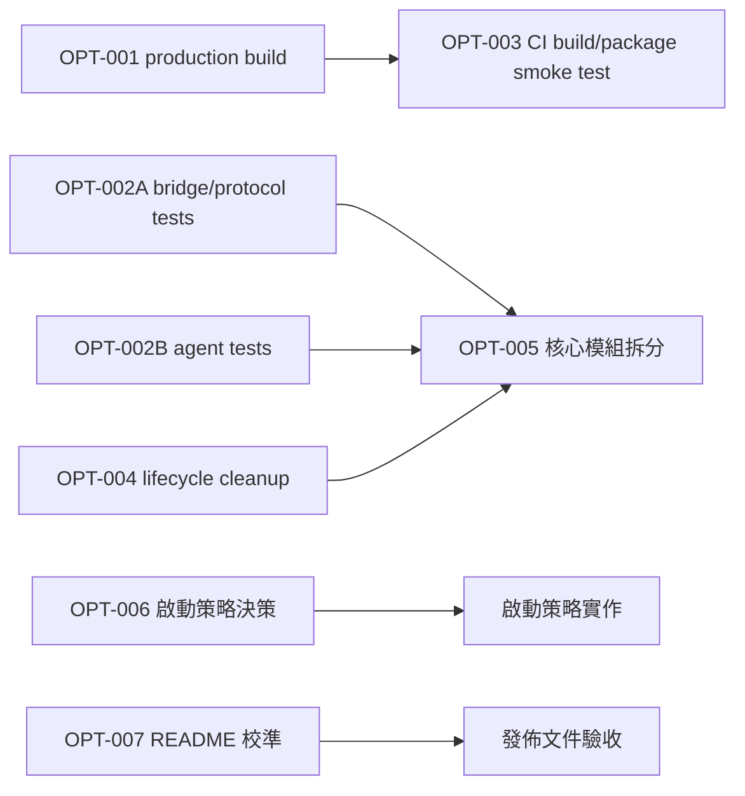

# 專案優化評估與派工建議

## 概要

本報告整理 hadome 目前可改善事項，目的是提供後續排程與派工依據。建議先處理可量化的發佈產物優化與可防止回歸的測試／CI，再逐步處理核心模組的可維護性。

本次為唯讀檢視；沒有修改專案程式碼或設定。工作目錄原本已有未提交變更，亦未納入本次判斷或變更範圍。

---

## 檢視範圍與證據

### 已執行驗證

| 項目 | 結果 | 證據 |
|---|---|---|
| Node.js 版本檢查 | 通過，Node.js 22.19.0 | `npm test` 前置檢查 |
| 單元／整合測試 | 17/17 通過，0 失敗 | `npm test` |
| webview 建置 | 成功 | `npm run build` |
| webview 目前 bundle 大小 | 約 2.2 MB | 建置輸出 `webview/dist/panel.js` |
| CI 盤點 | 已有 macOS Node 20 測試 job；未建置或封裝驗證 | [ci.yml](../.github/workflows/ci.yml) |

### 判讀原則

- 本報告將「已觀察到的事實」與「建議改善方向」分開敘述。
- 沒有重現的功能性問題不標示為 bug；例如 lifecycle 清理缺口列為資源管理風險。
- 不將工作目錄既有未提交變更視為品質問題。

---

## 優先級總覽

| 建議工單 | 優先級 | 類型 | 主要效益 | 可否直接派工 |
|---|---:|---|---|---|
| OPT-001 發佈版 webview production build | P1 | 效能／發佈 | 降低 VSIX 體積與載入成本 | 可以 |
| OPT-002 核心通訊與 agent 測試擴充 | P1 | 品質／可靠性 | 降低重連、逾時與狀態機回歸風險 | 可以，宜分批 |
| OPT-003 CI 建置與封裝 smoke test | P1 | 品質／交付 | 及早攔截無法建置或封裝的變更 | 可以 |
| OPT-004 extension lifecycle 資源清理 | P2 | 穩定性 | 完整釋放排程與背景資源 | 可以 |
| OPT-005 核心模組職責拆分 | P2 | 可維護性 | 降低高耦合與後續改動成本 | 可以，但須先寫規格 |
| OPT-006 啟動策略最佳化 | P3 | 體驗／效能 | 降低非使用者的啟動負擔 | 須先決策 |
| OPT-007 README 與實際發佈內容校準 | P3 | 文件 | 減少貢獻者與使用者誤解 | 可以 |

P1 為下一輪優先處理項目；P2 可接續進行；P3 屬於低風險改善或需先確認產品政策的項目。

---

## 詳細建議

### OPT-001：發佈版 webview production build

**現況**

封裝腳本執行一般 build，而一般 build 預設使用 development environment、未啟用 minify、產生 source map。實測產物 [panel.js](../webview/dist/panel.js) 約 2.2 MB；`.map` 雖被 [`.vscodeignore`](../.vscodeignore) 排除，未壓縮的 JavaScript 仍會被封入 VSIX。

**建議做法**

- 新增明確的 production build script，例如 `build:prod`。
- 封裝流程改用 production build，啟用 minify 並停用 source map。
- 保留一般 `build` 或 `watch` 的 developer-friendly source map，避免影響開發除錯。
- 在封裝後檢查產物存在、可載入，並記錄 bundle 大小供後續比較。

**涉及檔案**

- [build-webview.js](../tools/build-webview.js)
- [package-extension.js](../tools/package-extension.js)
- [package.json](../package.json)
- [`.vscodeignore`](../.vscodeignore)

**驗收條件**

- `npm run build` 維持可供本機開發與除錯。
- `npm run package` 使用 production bundle。
- 產生的 VSIX 可安裝，webview 可正常顯示。
- production bundle 小於目前 2.2 MB，且在工單報告記錄實際大小與縮減比例。

**風險與依賴**

- React production build 會降低可讀性，故不可取代開發用 build。
- 需先確認 VSIX 封裝流程是否有依賴 source map 的診斷工具；目前設定顯示 source map 本已不會封裝。

### OPT-002：核心通訊與 agent 測試擴充

**現況**

目前所有測試均集中在 [tools.test.js](../test/tools.test.js)，覆蓋安全工具層。高複雜度的 [agent.js](../src/agent.js)、[bridge.js](../src/bridge.js)、[protocol.js](../src/protocol.js)、[extension.js](../extension.js) 與 webview 狀態尚無自動化測試覆蓋。

**建議拆成兩張工單，避免範圍過大**

| 子工單 | 範圍 | 建議優先案例 |
|---|---|---|
| OPT-002A bridge／protocol | WebSocket 訊息與 waiter lifecycle | hello 選擇目標 tab、逾時、斷線、`done`／`error` 清理、未知或格式錯誤訊息 |
| OPT-002B agent 狀態機 | agent 的重試與模式約束 | tool call 重複、read-only 拒絕、重試上限、todo／done 防護、bridge 暫時失敗 |

extension 與 webview 的端對端測試應在上述核心測試穩定後再評估，避免一次引入過重的 VS Code test harness。

**驗收條件**

- 新測試均不依賴真實 ChatGPT、Chrome 或使用者帳號。
- 以 fake WebSocket、fake timer 與依賴注入覆蓋逾時／斷線等非決定性情境。
- 已有 [tools.test.js](../test/tools.test.js) 維持通過。
- 每張子工單至少證明一項「移除防護後測試會失敗」的回歸情境。

**風險與依賴**

- [bridge.js](../src/bridge.js) 目前直接建立 `WebSocketServer`，可能需先做小幅依賴注入，才易於測試。
- 不應為提高 coverage 而測試私有實作細節；測試應鎖定訊息契約與可觀察行為。

### OPT-003：CI 建置與封裝 smoke test

**現況**

目前 CI 僅執行 `npm ci` 與 `npm test`，且只在 macOS runner 上執行。這無法攔截 webview bundle 失敗、VSIX 封裝失敗或發佈檔遺漏。

**建議做法**

- 在現有 CI 加入 `npm run build`。
- 增加 `npm run package` 的 smoke test，並確認預期 VSIX 檔案存在。
- 評估把純 Node.js 測試移至 Linux runner；macOS job 則保留給確有平台相依的 browser／打包檢查。
- 待 OPT-001 完成後，CI 應驗證 production build 路徑。

**驗收條件**

- pull request 與推送到 `develop`／`main` 均會執行測試與 webview build。
- package job 能建立 VSIX 且在失敗時使 CI 失敗。
- 不在 CI 保存使用者帳號、瀏覽器 profile 或機密資料。

**相依關係**

- 可先完成，或與 OPT-001 同一輪進行；若分開，先加一般 build 驗證，再在 OPT-001 後補 package production 驗證。

### OPT-004：extension lifecycle 資源清理

**現況**

[extension.js](../extension.js) 的 `activate()` 在還原到排程時會建立 `scheduleTimer`；`deactivate()` 關閉 bridge，但未呼叫 `stopScheduleWatch()`。雖然 extension host 終止時通常會一併清除計時器，明確清理仍有助於測試、reload 與資源生命週期可預測性。

**建議做法**

- 在 `deactivate()` 停止 schedule watcher。
- 盤點由 extension 啟動的 child process、interval、timeout 和 panel listener，為可長存資源建立統一 cleanup 清單。
- 補一個最小測試或可注入的 timer seam，確認 deactivate 後不再觸發排程。

**驗收條件**

- deactivate 後不保留 schedule interval。
- bridge 現有關閉行為維持不變。
- 執行中的工作不會因 cleanup 順序而產生未處理 rejection。

### OPT-005：核心模組職責拆分

**現況**

核心檔案規模仍高： [extension.js](../extension.js) 約 3,755 行、[tools.js](../src/tools.js) 約 2,457 行、[agent.js](../src/agent.js) 約 1,961 行、[bridge.js](../src/bridge.js) 約 1,263 行。`handleRun()` 已有拆分紀錄，但 extension entrypoint 仍同時承擔 UI、session、權限、MCP、附件與 agent callbacks。

**建議做法**

- 先以「對外契約」而非行數作為拆分邊界。
- 優先把 extension 的 session orchestration、webview message routing、agent callback factory 分為獨立模組。
- 工具層則依檔案操作、命令操作、browser 操作與權限 policy 拆出內部 adapter；勿改動既有 tool schema。
- 每次僅拆一個邊界，先補回歸測試再移動實作。

**驗收條件**

- 外部 command、webview message、tool schema 與設定鍵保持相容。
- 每次拆分都有明確的責任邊界與回歸測試。
- 不以「將函式移到另一個檔案」作為完成標準；必須降低跨責任耦合。

**前置條件**

- 建議 OPT-002A 與 OPT-002B 至少完成其一，先為高風險契約建立保護網。

### OPT-006：啟動策略最佳化

**現況**

[package.json](../package.json) 宣告 `onStartupFinished`，使 extension 在每次 VS Code 啟動後載入。這能支援背景排程還原，但對從未使用此 extension 的工作階段也有啟動成本。

**需先做的產品決策**

是否必須在使用者未開啟 side view、未執行 command 的情況下，自動執行已排程工作？

- 若必須：保留背景啟動，著重縮小 activation path。
- 若不必須：改為 view、command 或 URI activation，再於首次互動時還原排程。

**驗收條件**

- 明確文件化排程在 VS Code 重啟後的預期行為。
- 不犧牲已承諾的排程觸發語意。
- 使用 VS Code Extension Host Profile 或等效量測，確認改善結果。

### OPT-007：README 與實際發佈內容校準

**現況**

[README.md](../README.md) 表示 test suite、measurement tools 與 development notes 不在 repository 中，但目前 repository 已追蹤 [test/tools.test.js](../test/tools.test.js) 與 [.github/workflows/ci.yml](../.github/workflows/ci.yml)。這可能是「公開發佈包不含」與「原始碼 repository 含有」兩種語境混用。

**建議做法與驗收條件**

- 明確區分 source repository、VSIX 與 Chrome package 各自包含的內容。
- 讓 README 的建置／測試說明與 `package.json` script 一致。
- 由非本專案作者依 README 在乾淨環境完成 `npm ci`、`npm test`、`npm run build`，作為可讀性驗收。

---

## 建議執行順序

建議排程：

1. **第一輪**：OPT-001、OPT-002A、OPT-003。三者可平行，但 OPT-003 的 package 驗證應在 OPT-001 的 build 介面定案後收尾。
2. **第二輪**：OPT-002B、OPT-004、OPT-007。這一輪以降低回歸風險和收斂文件為主。
3. **第三輪**：OPT-005。以已建立的測試作為安全網，逐邊界拆分。
4. **決策後執行**：OPT-006。由產品對背景排程語意作出選擇後再實作。

---

## 建議派工卡格式

每張工單應至少包含下列資訊，避免「優化」被寫成無法驗收的廣泛目標：

| 欄位 | 內容 |
|---|---|
| 目標 | 一句可驗收的使用者或系統結果 |
| 範圍 | 可修改與不可修改的模組／契約 |
| 前置條件 | 必須先完成的工單或決策 |
| 驗收條件 | 指令、測試案例、產物或量測門檻 |
| 非目標 | 本次刻意不處理的事項 |
| 回滾方式 | 可復原的 commit 或 feature flag 策略 |

---

## 結論

專案已有可運作的 Node.js 測試與 CI 基礎，並且安全工具層已有 17 個回歸測試。最具立即投資報酬的下一步是把 production build 納入封裝流程、擴充 bridge／agent 的契約測試、再將 build 與 package smoke test 放進 CI。完成這些保護網後，再處理大型核心模組拆分，會比直接重構更可控。

---

## 相關檔案

- [package.json](../package.json)
- [build-webview.js](../tools/build-webview.js)
- [package-extension.js](../tools/package-extension.js)
- [ci.yml](../.github/workflows/ci.yml)
- [extension.js](../extension.js)
- [agent.js](../src/agent.js)
- [bridge.js](../src/bridge.js)
- [tools.test.js](../test/tools.test.js)
